# P2_Probstat_C_5025201218

# Soal 1

### 1a. Carilah Standar Deviasi dari data selisih pasangan pengamatan tabel di atas

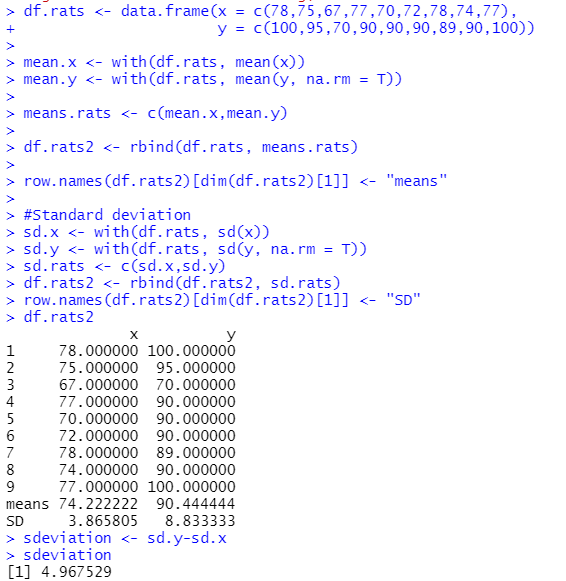

### 1b. carilah nilai t (p-value)

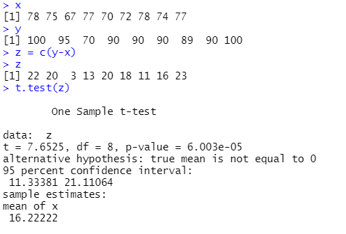

### 1c. tentukanlah apakah terdapat pengaruh yang signifikan secara statistika dalam hal kadar saturasi oksigen , sebelum dan sesudah melakukan aktivitas 𝐴 jika diketahui tingkat signifikansi 𝛼 = 5% serta H0 : “tidak ada pengaruh yang signifikan secara statistika dalam hal kadar saturasi oksigen , sebelum dan sesudah melakukan aktivitas 𝐴”

`jawab`

> dapat dapat dilihat bahwa nilai standar deviasi lebih kecil dari pada nilai rata – rata. Hal ini menunjukan bahwa variabel selisih y dan x yang di gunakan oleh penelitian ini tidak bervariasi. Nilai rata-rata sebesar 16.22222 lebih mendekati kearah nilai maximum, sehingga nilai rata-rata struktur modal dalam sampel penelitian ini cukup tinggi. Tingginya nilai selisih variabel X dan Y menunjukkan tingkat pengaruh yang signifikan secara statistika terhadap kadar saturasi oksigen

<!--  -->

# Soal 2

### 2a. Apakah Anda setuju dengan klaim tersebut?

### 2b. Jelaskan maksud dari output yang dihasilkan!

(jawaban 2a dan 2b jadi 1)

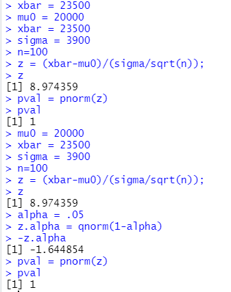

> the z-test statistics according to the information that we have from the statement. we use z-statistics because we know the mean μ and standard deviation σ, also we know that the sample size ≥30.
> Then, we calculate the left critical value. Now, we can conclude that the test statistic 8.974359 more than the critical value of -1.959964. Consequently, at .05 significance level, we accept the claim that mean a car is above 20000 km/year away.

### 2c. Buatlah kesimpulan berdasarkan P-Value yang dihasilkan!

> P value close to 1 suggests no difference between the groups other than due to chance.

<!--  -->

# Soal 3

### 3a. H0 dan H1

- Null hypothesis and test statistic

- H0 : μ1−μ2=0

- HA : μ1−μ2≠0

### 3b. Hitung Sampel Statistik

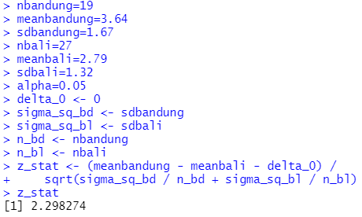

> Since it turns out to be greater than the .05
> significance level, we do not reject the null hypothesis

### 3c. Lakukan Uji Statistik (df =2)

### 3d. Nilai Kritikal

- per-one tail .025 significance level

- Two-Tailed 0.05 significance level

### 3e. Keputusan

> The test statistic 1.851676 lies between the critical values -4.302653 and 4.302653. Hence, at .05 significance level, we do not reject the null hypothesis that the mean Bandung and Bali does not differ.

### 3f. Kesimpulan

> we calculate the z-test statistics according to the information that we have from the Example 2. In this case, we use z-statistics because we know the mean μ and standard deviation σ
> z-test = 2.298274 Then we calculate pval to compute two tail p-value df the statistics Instead of using the critical value
> assume df=2 As it turns out to be greater than the .05 significance level, we do not reject the null hypothesis
> The test statistic 1.851676 lies between the critical values -4.302653 and 4.302653. Hence, at .05 significance level, we do not reject the null hypothesis that the mean Bandung and Bali does not differ.

<!--  -->

# Soal 4

### 4a. Buatlah masing masing jenis spesies menjadi 3 subjek "Grup" (grup 1,grup 2,grup 3). Lalu Gambarkan plot kuantil normal untuk setiap kelompok dan lihat apakah ada outlier utama dalam homogenitas varians.

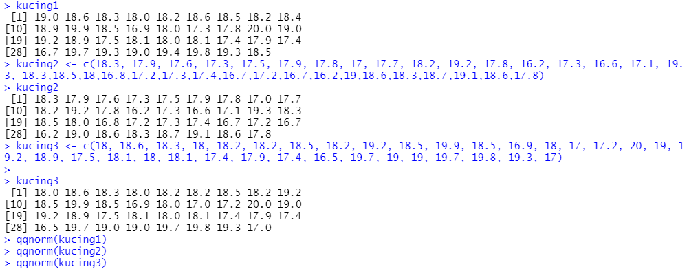

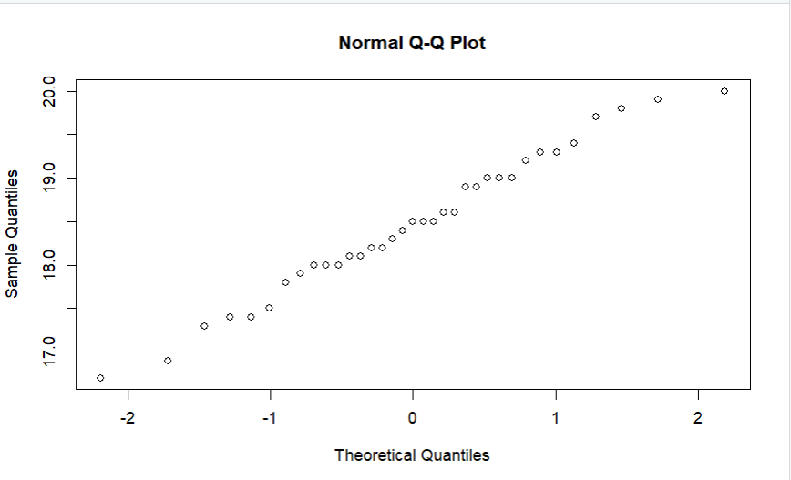

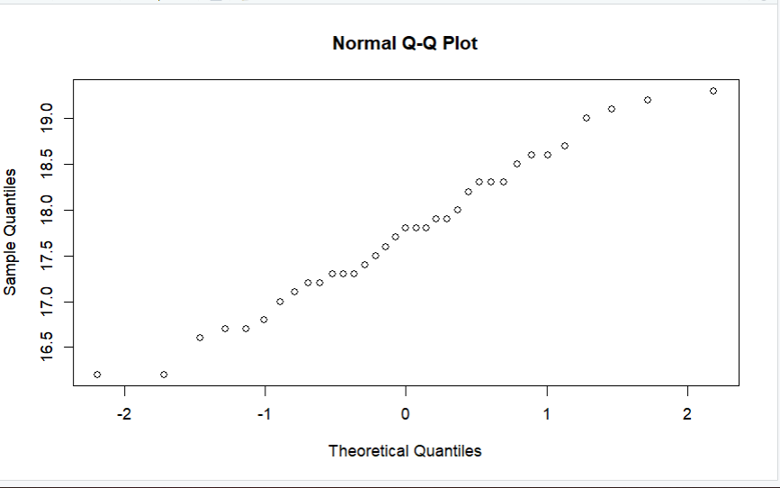

There were no extreme outliers

### 4b. carilah atau periksalah Homogeneity of variances nya , Berapa nilai p yang didapatkan? , Apa hipotesis dan kesimpulan yang dapat diambil ?

> From the output above we can see that the p-value is not less than the significance level of 0.05. This means that there is no evidence to suggest that the variance across groups is statistically significantly different. Therefore, we can assume there is no the homogeneity of variances in the different treatment groups.

### 4c. Untuk uji ANOVA (satu arah), buatlah model linier dengan Panjang versus. Grup dan beri nama model tersebut model 1.

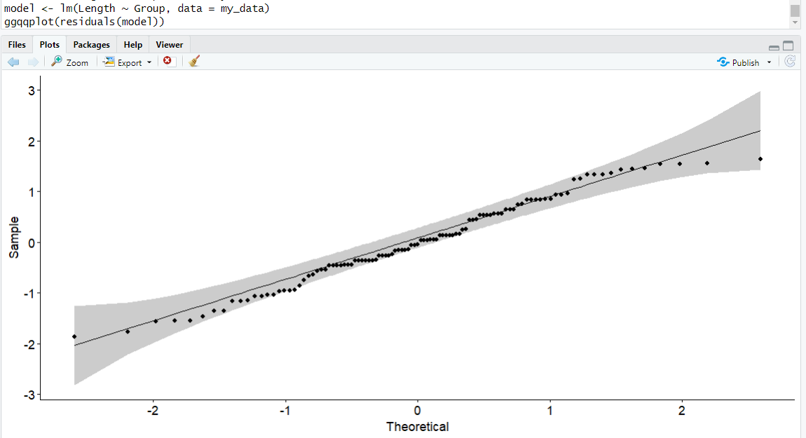

### 4d. Dari Hasil Poin C, Berapakah nilai-p ? , Apa yang dapat Anda simpulkan dari H0?

> The conclusion above, is supported by the Shapiro-Wilk test on the ANOVA residuals (W = 0.98017, p = 0.1176) which finds no indication that normality is violated.

### 4e. Verifikasilah jawaban model 1 dengan Post-hoc test Tukey HSD, dari nilai p yang didapatkan apakah satu jenis kucing lebih panjang dari yang lain? Jelaskan.

> The observed p-value from the ANOVA table is less than 0.05, indicating that there is enough evidence to conclude that the group means are not equal.

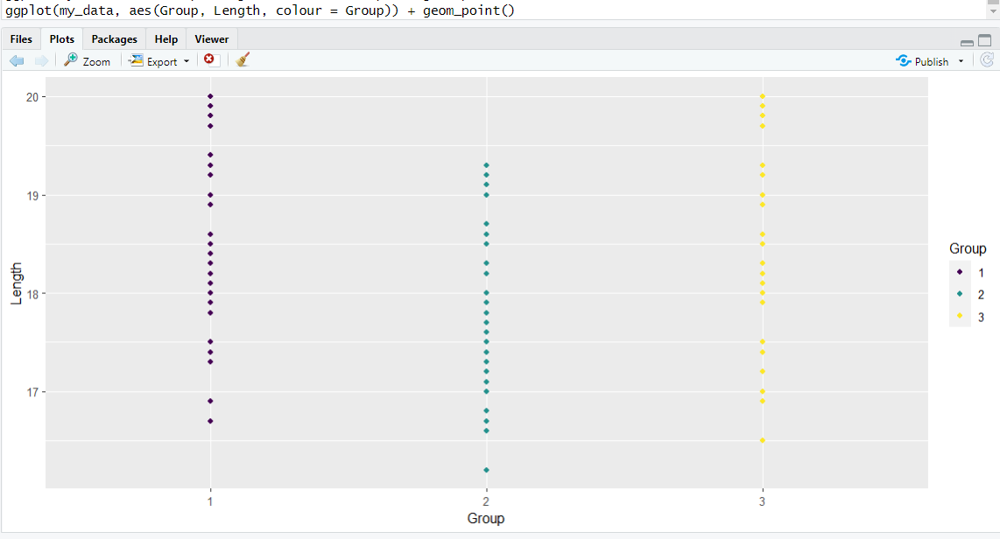

<!--  -->

### 5a. Buatlah plot sederhana untuk visualisasi data

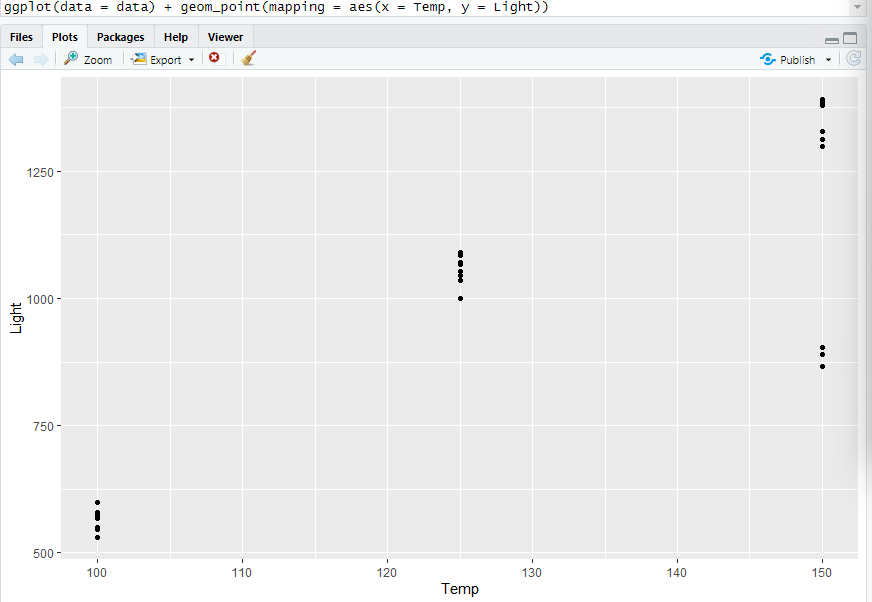

### 5b. Lakukan uji ANOVA dua arah

### 5c. Tampilkan tabel dengan mean dan standar deviasi keluaran cahaya untuk setiap perlakuan (kombinasi kaca pelat muka dan suhu operasi)

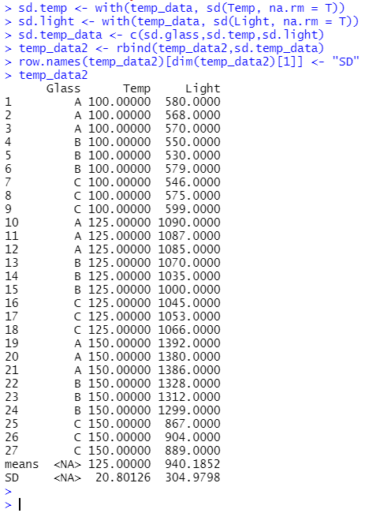
